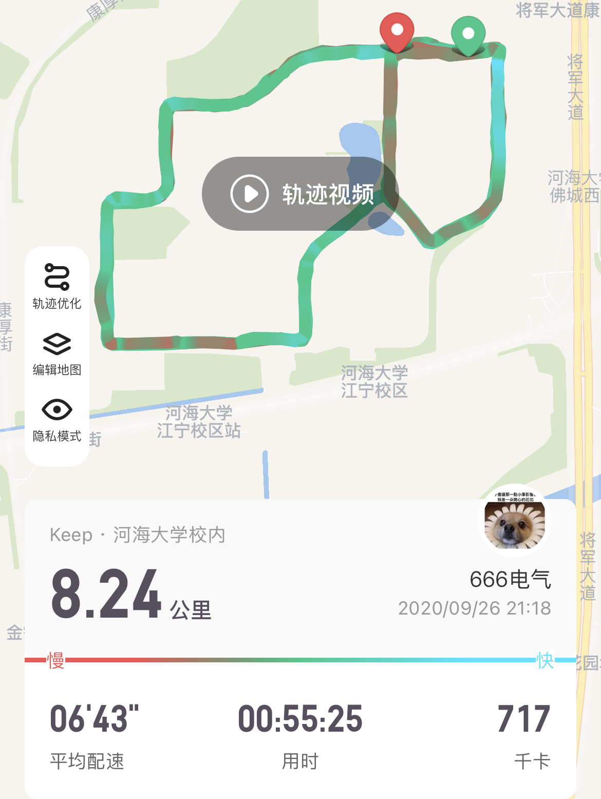

- [Teaching](#teaching)
- [LEGO Bricks](#lego-bricks)
- [Sports](#sports)
- [Instrument](#instrument)
- [Travel](#travel)

## Teaching 

I really enjoy the accomplishment of imparting my knowledge to others. Teaching, to me, is about fostering a sense of collaboration and inspiration. Through the sharing of my own learning experiences and methods, I strive to offer valuable advice and guidance to fellow students, enabling them to conquer their academic challenges. My goal is to empower them and help them overcome obstacles in their academic journey.

 
    

        Teaching and sharing
    

    
 

## LEGO Bricks

In my leisure time, I also engage in building with LEGO bricks. I thoroughly enjoy both the process of creating and the sense of accomplishment upon completing a project. Engaging in such activities not only enhances my manual dexterity but also allows me to completely immerse myself in the creative process, thus providing a means of relaxation.

 
    

        Saturn V
    

    
 

## Sports

Personally, I am deeply passionate about a range of activities including hiking, long-distance running, badminton, and swimming. The invigorating feeling of breaking a sweat is something I truly relish. Engaging in physical activities not only helps me alleviate stress but also rejuvenates my mind, body, and soul.

 
    

        Running record on Keep APP
    

    
 

## Instrument

I've been playing the bamboo flute since the fourth grade of elementary school. I enjoy playing Chinese classical music as well as some well-known pop songs. I thoroughly enjoy immersing myself in the artistic realm of the music I play, allowing me to fully experience the emotions and atmosphere created by each piece.

 
    

        Playing bamboo flute
    

    
 

## Travel

There must be something truly magical about traveling, which allows me to immerse myself in diverse cultures. I have had the opportunity to explore captivating destinations such as Yunnan, Guizhou, Anhui, and Singapore. This upcoming summer, I am excitedly planning a visit to Macau to further enrich my travel experiences.

 
    

        left: Singapore Universal Studios; right: Huangguoshu Waterfall
    

    
 

