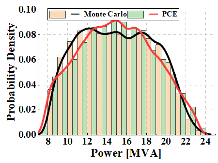

- [1. Managing Stochastic Optimal Power Flow (OPF) Facing High Renewable Penetration](#1-managing-stochastic-optimal-power-flow-opf-facing-high-renewable-penetration)
- [2. Mechanism Design and Assessment of Power Trade in the Greater Mekong Subregion (GMS) Countries](#2-mechanism-design-and-assessment-of-power-trade-in-the-greater-mekong-subregion-gms-countries)
- [3. Decentralized Implementation of Energy Markets](#3-decentralized-implementation-of-energy-markets)
- [4. Detection of Abnormal Working Conditions of Energy Storage Batteries](#4-detection-of-abnormal-working-conditions-of-energy-storage-batteries)

## 1. Managing Stochastic Optimal Power Flow (OPF) Facing High Renewable Penetration

Supervisors: [Prof. Wei Gu](https://ee.seu.edu.cn/2021/0331/c25364a366894/page.htm), [Prof. Yijun Xu](https://sites.google.com/view/yijunxu/home), [Assoc. Prof. Zhi Wu](http://www.wuzhiseu.com/)

Sep. 2022 -- Present, Southeast University

Uncertainty quantification (UQ) is the core of uncertainty analysis, which tries to quantify the outcomes when inputs are subject to uncertainties. This problem is vital in modern power systems for the inherent randomness of renewable generations.

In my research of uncertainty in power systems, I mainly focus on efficient high-dimensional UQ, as well as UQ-informed decision-making, specifically stochastic opf. We have designed two different approaches to handle stochastic opf. The first one conducts data-driven surrogate modeling under arbitrarily distributed and correlated uncertainties using a recent variant of polynomial chaos expansion (PCE), which is more accurate than traditional PCE methods, as revealed in the figure below. In this work, we also embedded voltage stability constraint into the problem and developed a novel framework to enhance scalability in large-scale systems.

The second work, currently in preparation, relies on a novel deterministic sampling method that requires significantly less computational effort than the Monte Carlo method. This appealing property makes it quite suitable to be combined with the distributionally robust method to deal with chance constraints.

·
·
·

 
    

        left: PCE with Nataf Transformation; right: Proposed APCE
    

    
 

## 2. Mechanism Design and Assessment of Power Trade in the Greater Mekong Subregion (GMS) Countries

*Core Team Member, Science and Technology Project of China Southern Power Grid Co., Ltd.*

April 2021 -- June 2023, Yunnan Electric Power Research Institute

The GMS countries, comprising China, Cambodia, Laos, Myanmar, Thailand, and Vietnam, have recognized regional power trading as a critical area for development. However, till now, numerous barriers still hinder a greater uptake of regional power trading. This project aimed to highlight the barriers, assess the trading potential in the GMS, and design future trading mechanisms and a roadmap to increase regional power trade. 

As a core team member, I have have actively contributed throughout the entire project. My responsibilities have encompassed collecting reports from various government departments and organizations to provide robust data support. Additionally, I have independently written three technical reports and collaborated on the creation of presentation slides.

 
    

        Work Scene
    

    
 

## 3. Decentralized Implementation of Energy Markets

Supervisors: [Prof. Wei Gu](https://ee.seu.edu.cn/2021/0331/c25364a366894/page.htm), [Assoc. Prof. Zhi Wu](http://www.wuzhiseu.com/)

Sep. 2021 -- Aug. 2022, Southeast University

## 4. Detection of Abnormal Working Conditions of Energy Storage Batteries

*Team Leader, College Students' Innovative Entrepreneurial Training Plan Program*

Supervisor: [Prof. Hongzhong Ma](http://jszy.hhu.edu.cn/mhz/)

July 2019 -- May 2020, Hohai University

