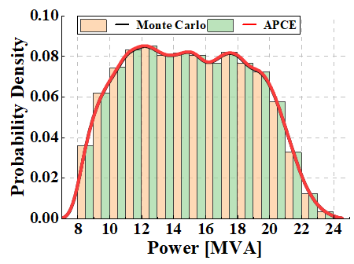
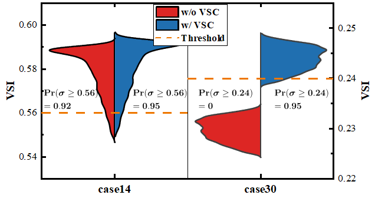
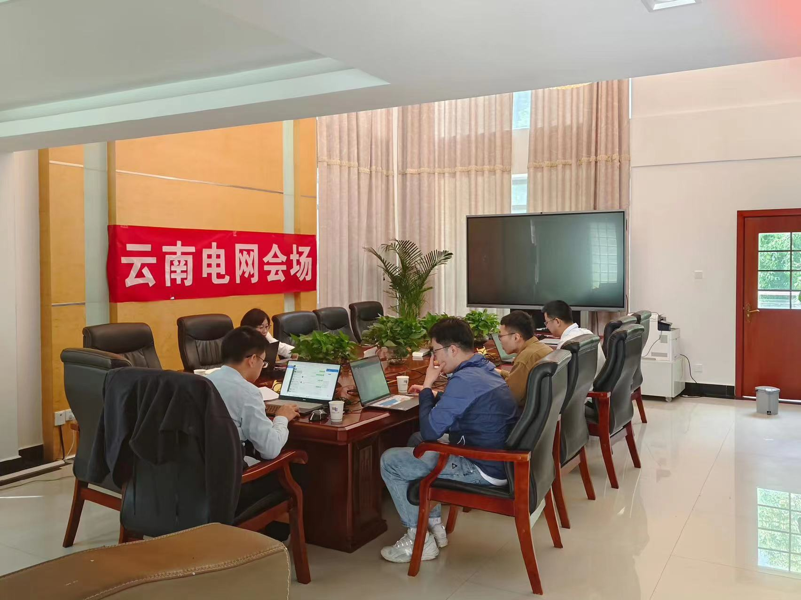
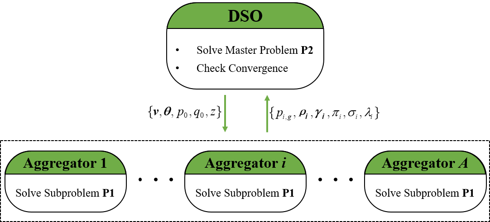
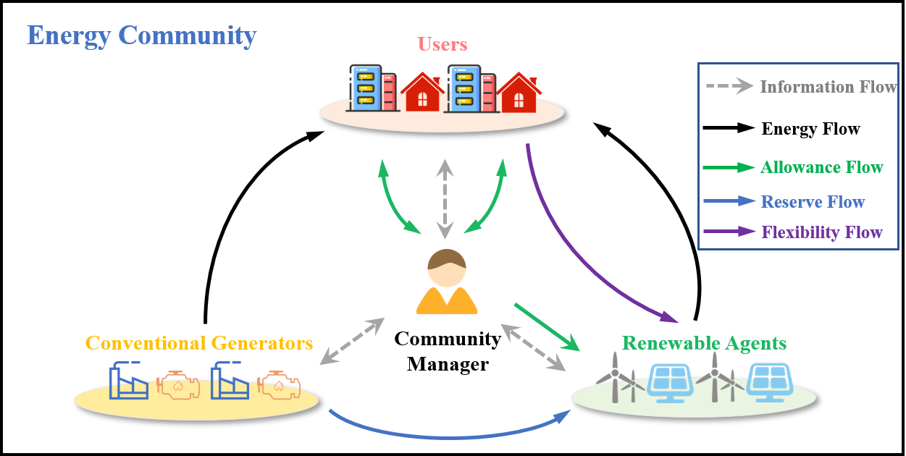
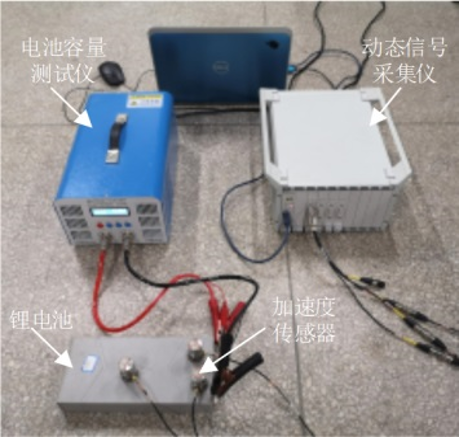
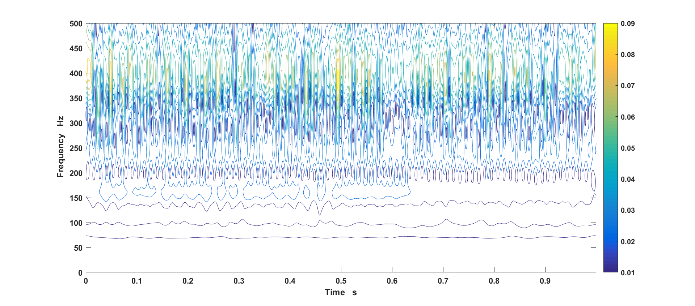

- [1. Algorithm for Stochastic OPF Facing High Renewable Penetration](#1-algorithm-for-stochastic-opf-facing-high-renewable-penetration)
- [2. Mechanism Design and Assessment of Power Trade in the Greater Mekong Subregion (GMS) Countries](#2-mechanism-design-and-assessment-of-power-trade-in-the-greater-mekong-subregion-gms-countries)
- [3. Decentralized Implementation of Energy Markets and Mechanism Design](#3-decentralized-implementation-of-energy-markets-and-mechanism-design)
- [4. Detection of Abnormal Working Conditions of Energy Storage Batteries](#4-detection-of-abnormal-working-conditions-of-energy-storage-batteries)

## 1. Algorithm for Stochastic OPF Facing High Renewable Penetration

Supervisors: [Prof. Wei Gu](https://ee.seu.edu.cn/2021/0331/c25364a366894/page.htm), [Prof. Yijun Xu](https://sites.google.com/view/yijunxu/home), [Assoc. Prof. Zhi Wu](http://www.wuzhiseu.com/)

Research Output: [J1](https://yxwu1999.github.io/publications#J1) & [M1](https://yxwu1999.github.io/publications#M1)

Sep. 2022 -- June 2024, Southeast University

Uncertainty quantification (UQ) is the core of uncertainty analysis, which tries to quantify the outcomes when inputs are subject to uncertainties. This problem is vital in modern power systems for the inherent randomness of renewable generations.

In my research of uncertainty in power systems, I mainly focus on efficient high-dimensional UQ, as well as UQ-informed decision-making, specifically stochastic opf. We have designed two different approaches to handle stochastic opf. The first one conducts data-driven surrogate modeling under arbitrarily distributed and correlated uncertainties using a recent variant of polynomial chaos expansion (PCE), which is more accurate than traditional PCE methods. In this work, we also embedded voltage stability constraint into the problem and developed a novel framework to enhance scalability in large-scale systems.

The second work, relies on a novel deterministic sampling method based on unscented transform that requires significantly less computational effort than the Monte Carlo method. This appealing property makes it quite suitable to deal with chance constraints.

 
    

        left: Accuracy of the proposed APCE; right: Improvement of voltage stability
    

    
 

---

## 2. Mechanism Design and Assessment of Power Trade in the Greater Mekong Subregion (GMS) Countries

*Core Team Member, Science and Technology Project of China Southern Power Grid Co., Ltd.*

April 2022 -- June 2023, Yunnan Electric Power Research Institute

The GMS countries, comprising China, Cambodia, Laos, Myanmar, Thailand, and Vietnam, have recognized regional power trading as a critical area for development. However, till now, numerous barriers still hinder a greater uptake of regional power trading. This project aimed to highlight the barriers, assess the trading potential in the GMS, and design future trading mechanisms and a roadmap to increase regional power trade. 

As a core team member, I have actively contributed throughout the entire project. My responsibilities have encompassed collecting reports from various government departments and organizations to provide robust data support. Additionally, I have independently written three technical reports and collaborated on the creation of presentation slides.

 
    

        Work scene
    

    
 

---

## 3. Decentralized Implementation of Energy Markets and Mechanism Design

Supervisors: [Prof. Wei Gu](https://ee.seu.edu.cn/2021/0331/c25364a366894/page.htm), [Assoc. Prof. Zhi Wu](http://www.wuzhiseu.com/)

Research Output: [J1](https://yxwu1999.github.io/publications#J1) & [C1](https://yxwu1999.github.io/publications#C1) & [M2](https://yxwu1999.github.io/publications#M2)

Sep. 2021 -- Aug. 2022, Southeast University

With the increasing integration of user-end distributed energy resources into the distribution network, competitive energy markets, such as peer-to-peer (P2P) markets, have emerged in recent years. numerous factors critical to the successful implementation of these energy markets require attention. In this field, I have conducted several works: 

- The first work focused on the ancillary service market. This work devised a novel market mechanism named FVCG, comprising a choice rule and a payment rule. The multi-cut version of Benders decomposition was adopted to implement the choice rule in a distributed manner (left figure). Moreover, a novel payment rule was proposed to incentive all agents to contribute. Its incentive compatibility and individual rationality have been rigorously proved. 

- In response to the growing emphasis on carbon neutrality, the second work proposed a joint energy, uncertainty, and carbon allowance trading market (right figure). Besides, a fully decentralized optimization method was developed based on a combination of a modified tightening McCormick method and the alternating direction method of multipliers, ensuring both accuracy and the preservation of each agent's privacy.  

 
    

        left: Distributed procedure with Benders decomposition; right: Joint trading framework
    

    
 

---

## 4. Detection of Abnormal Working Conditions of Energy Storage Batteries

*Team Leader, Undergraduate Students' Innovative Entrepreneurial Training Plan Program*

Supervisor: [Prof. Hongzhong Ma](http://jszy.hhu.edu.cn/mhz/)

Research Output: [J2](https://yxwu1999.github.io/publications#J2) & [J3](https://yxwu1999.github.io/publications#J3)

July 2019 -- May 2020, Hohai University

Lithium-ion battery systems have emerged as critical components in modern power systems, with their safe and stable operation directly impacting the feasibility of large-scale development in energy storage stations. This project aims to detect early-stage abnormal working conditions in batteries through the analysis of vibration signals.

As the team leader, I have taken responsibility for the entire project, including formulating the experimental plan, procuring necessary equipment, setting up the experimental platform, conducting experiments, analyzing data, and writing the research paper. Our investigations have unveiled substantial differences in vibration signals exhibited by batteries under various operating conditions. Consequently, our findings supported the feasibility of implementing a strategy for anomaly detection in batteries based on vibration signals.

 
    

        left: Experimental platform; right: Spectrogram 
    

    
 

